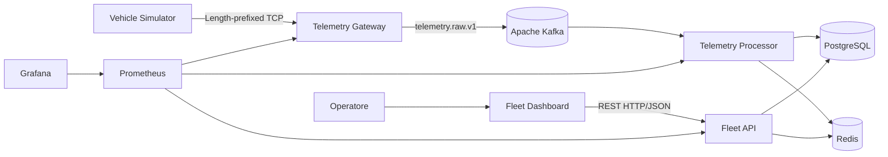

# FleetPulse

FleetPulse è una piattaforma distribuita per acquisire, elaborare e consultare
la telemetria sintetica di una flotta di veicoli.

I simulatori mantengono connessioni TCP persistenti con il gateway e inviano
messaggi con framing length-prefixed. Il gateway valida i messaggi e li pubblica
su Kafka; il processor li elabora in modo asincrono, persiste lo storico in
PostgreSQL e aggiorna la proiezione dello stato corrente in Redis. Fleet API
espone i dati tramite REST al Fleet Dashboard destinato agli operatori.

Tutti i dati sono sintetici. Il progetto non implementa né emula protocolli
automotive proprietari.

## Architettura



### Componenti

| Componente | Responsabilità |
|---|---|
| `vehicle-simulator` | Genera telemetria sintetica e gestisce i client TCP |
| `telemetry-gateway` | Ricostruisce e valida i frame, quindi pubblica gli eventi su Kafka |
| `telemetry-processor` | Consuma gli eventi, persiste i sample, aggiorna Redis e valuta gli alert |
| `fleet-api` | Espone veicoli, stato corrente, storico e alert tramite API REST |
| `telemetry-contracts` | Definisce i contratti dei messaggi scambiati tramite Kafka |
| `tcp-protocol` | Definisce costanti e modelli ACK/NACK del protocollo TCP |
| `fleet-dashboard` | Client web funzionale per gli operatori; utilizza esclusivamente Fleet API |
| PostgreSQL | Source of truth persistente |
| Redis | Proiezione ricostruibile dello stato più recente |
| Apache Kafka | Trasporto asincrono degli eventi e buffering |
| Prometheus e Grafana | Observability tecnica, separata dal Fleet Dashboard |

Encoder e decoder TCP non sono condivisi: simulator e gateway implementano
indipendentemente il framing per evitare che lo stesso errore sui due lati renda
un test apparentemente corretto.

## Struttura del repository

```text
FleetPulse/
├── libraries/
│   ├── telemetry-contracts/
│   └── tcp-protocol/
├── services/
│   ├── telemetry-gateway/
│   ├── telemetry-processor/
│   └── fleet-api/
├── simulators/
│   └── vehicle-simulator/
├── frontend/
│   └── fleet-dashboard/
├── docs/
├── compose.yaml
└── pom.xml
```

I servizi, le librerie e il simulator fanno parte del reactor Maven. Il Fleet
Dashboard è progettato ma non ancora implementato e comunica esclusivamente con
Fleet API. Grafana è un'interfaccia tecnica distinta, riservata
all'observability.

## Avvio locale

### Prerequisiti

- JDK 21;
- Docker con Docker Compose.

Maven non deve essere installato: il repository include Maven Wrapper.

### Build

```bash
./mvnw clean verify
```

### Avvio della piattaforma

```bash
docker compose up --build
```

Per arrestare i container:

```bash
docker compose down
```

Per eliminare anche i volumi locali:

```bash
docker compose down --volumes
```

## Documentazione

| Documento | Contenuto |
|---|---|
| [Visione e scope](docs/01_VISIONE_E_SCOPE.md) | Scopo e obiettivi di qualità |
| [Requisiti](docs/02_REQUISITI.md) | Requisiti funzionali e non funzionali |
| [Use case](docs/03_USE_CASE.md) | Attori e flussi applicativi |
| [Domain model](docs/04_DOMAIN_MODEL.md) | Entità, invarianti e stato |
| [Architettura](docs/05_ARCHITETTURA_DI_SISTEMA.md) | Componenti, responsabilità e flussi |
| [Protocollo TCP](docs/06_PROTOCOLLO_TCP.md) | Framing e comportamento delle connessioni |
| [Data model](docs/07_DATA_MODEL.md) | Persistenza e cache |
| [Event model](docs/08_EVENT_MODEL.md) | Topic, schema e delivery semantics |
| [API](docs/09_SPECIFICA_API.md) | Risorse REST e convenzioni delle risposte |
| [Affidabilità](docs/10_AFFIDABILITA_E_GUASTI.md) | Guasti, retry, idempotency e degradazione |
| [Observability](docs/11_OBSERVABILITY.md) | Log, metriche e health check |
| [Strategia di test](docs/12_STRATEGIA_DI_TEST.md) | Unit, integration ed end-to-end test |
| [Deployment](docs/13_DEPLOYMENT.md) | Topologia dei container e configurazione |
| [ADR](docs/adr/) | Decisioni architetturali |
