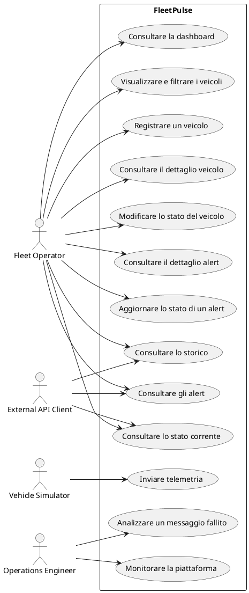

# Use case

## 1. Attori

| Attore | Descrizione |
|---|---|
| Fleet Operator | Usa il Fleet Dashboard per registrare i veicoli e consultare i dati della flotta |
| Vehicle Simulator | Apre una connessione TCP e trasmette telemetria sintetica |
| Operations Engineer | Monitora i servizi e analizza i guasti |
| External API Client | Integra le proprie funzioni con Fleet API |

## 2. Panoramica



## 3. UC-01 — Registrare un veicolo

### Attore principale

Fleet Operator.

### Precondizioni

- Fleet API disponibile;
- codice esterno e targa non già assegnati.

### Flusso principale

1. L'attore invia i dati di registrazione.
2. Fleet API valida i campi.
3. Fleet API persiste il veicolo.
4. Fleet API restituisce la risorsa creata.

### Flussi alternativi

- codice o targa duplicati: `409 Conflict`;
- campo non valido: `400 Bad Request`;
- database non disponibile: errore temporaneo e log diagnostico.

### Postcondizioni

Il veicolo esiste con uno stato operativo esplicito.

## 4. UC-02 — Inviare telemetria

### Attore principale

Vehicle Simulator.

### Precondizioni

- veicolo registrato e attivo;
- gateway raggiungibile.

### Flusso principale

1. Il simulatore apre una connessione TCP.
2. Codifica un payload.
3. Aggiunge il prefisso di lunghezza.
4. Il gateway ricostruisce e valida il frame.
5. Il gateway pubblica l'evento su Kafka.
6. Kafka conferma l'accettazione.
7. Il gateway restituisce un application ACK.

### Flussi alternativi

- lunghezza non valida: rifiuto;
- protocol version non supportata: NACK;
- veicolo sconosciuto o disabilitato: rifiuto;
- timeout Kafka: nessun ACK positivo;
- disconnessione a metà frame: frame incompleto scartato.

## 5. UC-03 — Elaborare la telemetria

### Trigger

Kafka consegna un evento.

### Flusso principale

1. Il processor deserializza e valida.
2. Verifica l'idempotency key.
3. Persiste il sample.
4. Valuta le regole di alert.
5. Persiste gli alert.
6. Aggiorna Redis.
7. Completa l'elaborazione.

### Flussi alternativi

- duplicate `messageId`: nessun nuovo side effect;
- PostgreSQL non disponibile: bounded retry;
- Redis non disponibile: persistenza valida, stato degradato;
- evento permanentemente invalido: dead-letter topic.

## 6. UC-04 — Consultare lo stato corrente

1. Il client richiede lo stato.
2. Fleet API legge Redis.
3. In caso di hit restituisce la cache.
4. In caso di miss o guasto legge PostgreSQL.
5. Se possibile ripopola Redis.

## 7. UC-05 — Consultare lo storico

1. Il client specifica veicolo, intervallo e paginazione.
2. Fleet API valida i parametri.
3. PostgreSQL restituisce i sample ordinati.
4. Fleet API restituisce la pagina.

## 8. UC-06 — Consultare gli alert

Il client può filtrare per `status`, `type`, `severity` e intervallo temporale.

## 9. UC-07 — Aggiornare un alert

Transizioni supportate:

```text
OPEN -> ACKNOWLEDGED -> CLOSED
OPEN -> CLOSED
```

## 10. UC-08 — Monitorare la piattaforma

L'Operations Engineer consulta:

- liveness e readiness;
- connessioni attive;
- frame accettati e rifiutati;
- errori di elaborazione;
- processing latency;
- stato delle dipendenze.

## 11. UC-09 — Analizzare un messaggio fallito

1. Ricerca del `messageId`.
2. Verifica dell'accettazione nel gateway.
3. Verifica della producer acknowledgement.
4. Verifica del consumo.
5. Verifica della persistenza.
6. Verifica della dead-letter topic.

## 12. UC-10 — Consultare la dashboard

1. Il Fleet Operator apre il Fleet Dashboard.
2. Il dashboard richiede a Fleet API la panoramica della flotta.
3. Fleet API restituisce totali, distribuzione per stato, veicoli attivi di
   recente e riepilogo degli alert.
4. Il dashboard aggiorna periodicamente i dati tramite polling REST.

## 13. UC-11 — Visualizzare e filtrare i veicoli

1. Il Fleet Operator apre l'elenco dei veicoli.
2. Specifica facoltativamente testo di ricerca, stato e paginazione.
3. Fleet API restituisce la pagina corrispondente.
4. Il dashboard mostra i risultati e i controlli di navigazione.

## 14. UC-12 — Consultare il dettaglio di un veicolo

1. Il Fleet Operator seleziona un veicolo.
2. Il dashboard richiede dati anagrafici, stato operativo e ultima telemetria.
3. Il Fleet Operator può selezionare un intervallo temporale.
4. Il dashboard richiede e mostra lo storico telemetrico paginato.

La registrazione del veicolo segue UC-01; la consultazione dell'ultima
telemetria e dello storico specializzano rispettivamente UC-04 e UC-05.

## 15. UC-13 — Consultare gli alert dal Fleet Dashboard

1. Il Fleet Operator apre l'elenco degli alert.
2. Applica facoltativamente filtri per veicolo, tipo, severità e stato.
3. Fleet API restituisce una pagina di alert.
4. Il Fleet Operator seleziona un alert.
5. Fleet API restituisce il dettaglio dell'alert.

La consultazione dell'elenco specializza UC-06. L'eventuale aggiornamento dello
stato segue UC-07.
