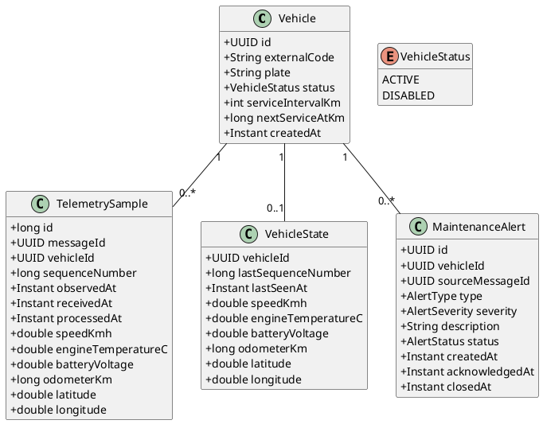
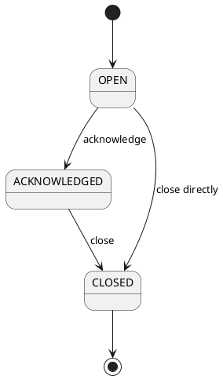

# Domain model

## 1. Modello



## 2. Vehicle

Rappresenta una sorgente di telemetria registrata.

### Invarianti

- `externalCode` univoco e immutabile;
- `plate` univoca;
- `serviceIntervalKm` positivo;
- `nextServiceAtKm` non negativo;
- soltanto i veicoli `ACTIVE` possono inviare telemetria accettata.

## 3. TelemetrySample

Rappresenta un'osservazione storica immutabile.

### Invarianti

- `messageId` univoco;
- `sequenceNumber` non negativo;
- timestamp entro la clock-skew policy;
- velocità non negativa;
- latitudine tra `-90` e `90`;
- longitudine tra `-180` e `180`;
- valori di temperatura e tensione entro sanity bound configurati.

## 4. VehicleState

Rappresenta lo stato più recente.

È una projection ricostruibile e non sostituisce lo storico persistito.

## 5. MaintenanceAlert

Rappresenta una condizione deterministica derivata da un sample.

### Invarianti

- combinazione `sourceMessageId + type` univoca;
- transizioni di stato controllate;
- `type` e source message immutabili;
- `acknowledgedAt` non precedente a `createdAt`;
- `closedAt` non precedente a `acknowledgedAt`, quando presente, altrimenti a `createdAt`.

## 6. Stato degli alert



## 7. Domain service

### AlertRule

```java
interface AlertRule {
    Optional<AlertProposal> evaluate(
        Vehicle vehicle,
        TelemetrySample sample
    );
}
```

Implementazioni iniziali:

- `EngineTemperatureRule`
- `BatteryVoltageRule`
- `ServiceDueRule`

## 8. Confini del dominio

Il domain model non dipende direttamente da:

- Kafka API;
- Redis client;
- socket TCP;
- HTTP request;
- dettagli di deployment.
