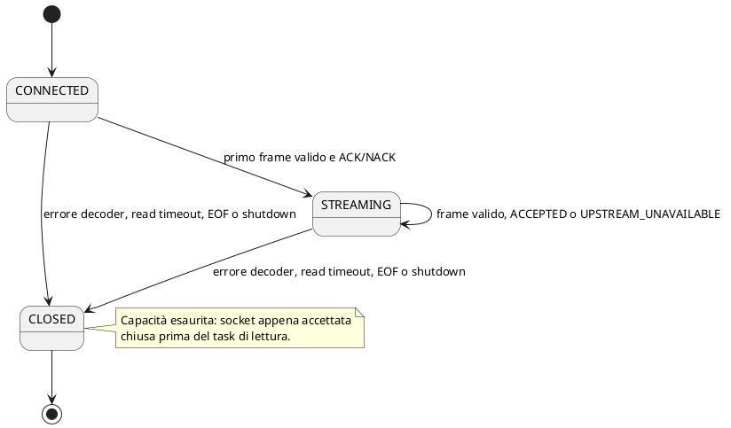

# Specifica del protocollo TCP

## 1. Scopo

Il protocollo trasporta telemetria dai client simulati al Telemetry Gateway tramite connessioni TCP persistenti.

TCP fornisce uno stream ordinato di byte, ma non conserva i confini dei messaggi applicativi. FleetPulse definisce quindi un framing esplicito.

## 2. Frame format

```text
+------------------------------+--------------------------------+
| Payload length               | Payload                        |
| 4 byte unsigned, big-endian  | JSON UTF-8, lunghezza dichiarata|
+------------------------------+--------------------------------+
```

## 3. Parametri

| Parametro | Default |
|---|---:|
| Header size | 4 byte |
| Maximum payload | 65.536 byte |
| Encoding | UTF-8 |
| Byte order | Big-endian |
| Connection model | Persistent |
| Read timeout | `30s`, configurabile |
| Maximum connections | `100`, configurabile |
| Invalid frame policy | Chiusura al primo errore |

## 4. Requisiti del decoder

Il decoder deve gestire:

- header diviso tra più socket read;
- payload diviso tra più socket read;
- più frame completi in un singolo buffer;
- frame completo seguito da frame parziale;
- lunghezze invalide;
- EOF prima del completamento;
- JSON malformato;
- protocol version non supportata.

Non deve mai assumere:

```text
una socket read = un messaggio applicativo
```

## 5. Payload

```json
{
  "protocolVersion": 1,
  "messageId": "dc0fc799-0913-4e72-bd2d-8ee8ccf52e22",
  "vehicleId": "97e194a8-64b3-4885-b1e6-25fd482f58c0",
  "sequenceNumber": 42,
  "observedAt": "2026-08-01T10:15:30Z",
  "speedKmh": 72.4,
  "engineTemperatureC": 91.8,
  "batteryVoltage": 12.6,
  "odometerKm": 85312,
  "latitude": 41.9028,
  "longitude": 12.4964
}
```

## 6. Application acknowledgement

### Accepted

```json
{
  "protocolVersion": 1,
  "messageId": "dc0fc799-0913-4e72-bd2d-8ee8ccf52e22",
  "status": "ACCEPTED",
  "receivedAt": "2026-08-01T10:15:30.083Z"
}
```

### Rejected sincrono per pubblicazione Kafka non confermata

```json
{
  "protocolVersion": 1,
  "messageId": "dc0fc799-0913-4e72-bd2d-8ee8ccf52e22",
  "status": "REJECTED",
  "errorCode": "UPSTREAM_UNAVAILABLE",
  "receivedAt": "2026-08-01T10:15:30.083Z"
}
```

Le risposte ACK/NACK usano lo stesso framing length-prefixed del payload.
Il gateway corrente invia `REJECTED` con `UPSTREAM_UNAVAILABLE` dopo aver
decodificato un messaggio valido. Errori di framing, JSON, validazione o versione
sono rilevati nel decoder: la connessione viene chiusa senza ACK/NACK. Anche
il superamento del limite connessioni causa chiusura, senza risposta applicativa.

## 7. Semantica dell'ACK

`ACCEPTED` significa:

- frame accettato e ricostruito;
- validazione tecnica riuscita;
- Kafka ha confermato l'accettazione.

Non significa che:

- il veicolo esista;
- il veicolo sia `ACTIVE`;
- il consumer abbia persistito il dato;
- Redis sia stato aggiornato;
- un alert sia stato generato;
- il processor abbia completato l'elaborazione.

La verifica di esistenza e stato del veicolo avviene nel processor.
`UNKNOWN_VEHICLE` e `VEHICLE_DISABLED` sono rifiuti asincroni di dominio e non
sono NACK del protocollo TCP.

## 8. Lifecycle della connessione


```plantuml
@startuml
[*] --> CONNECTED
CONNECTED --> STREAMING : primo frame valido e ACK/NACK
CONNECTED --> CLOSED : errore decoder, read timeout, EOF o shutdown
STREAMING --> STREAMING : frame valido, ACCEPTED o UPSTREAM_UNAVAILABLE
STREAMING --> CLOSED : errore decoder, read timeout, EOF o shutdown
CLOSED --> [*]
note right of CLOSED
  Capacità esaurita: socket appena accettata
  chiusa prima del task di lettura.
end note
@enduml
```

## 9. Error code

| Codice | Significato |
|---|---|
| `FRAME_TOO_LARGE` | Payload oltre il limite |
| `INVALID_FRAME_LENGTH` | Lunghezza non valida |
| `MALFORMED_PAYLOAD` | Payload non decodificabile |
| `UNSUPPORTED_PROTOCOL_VERSION` | Versione non supportata |
| `INVALID_TELEMETRY` | Validazione fallita |
| `UPSTREAM_UNAVAILABLE` | Kafka non confermato |
| `CAPACITY_LIMIT_REACHED` | Capacità del gateway esaurita |

L'enum condiviso riserva questi codici tecnici; la loro presenza non garantisce
che siano trasmessi sul wire. Attualmente solo `UPSTREAM_UNAVAILABLE` viene
emesso in un NACK; gli altri errori causano chiusura osservabile via log/metriche. I rifiuti di dominio sono documentati nel modello
eventi.

## 10. Retry del client

Il client può ritentare quando non riceve un ACK positivo.

Il retry deve riutilizzare lo stesso `messageId`.

Il `confirmation-timeout` limita l’attesa della future dopo `publish()`, non
l’intera risposta TCP: la chiamata sincrona del producer può attendere metadata
o spazio nel buffer prima di restituire la future. Il budget complessivo
durante outage Kafka rimane un limite operativo aperto, da risolvere in FP-056.
Un NACK o timeout non prova l’assenza di una consegna tardiva: il retry mantiene
lo stesso `messageId` per permettere la deduplicazione del processor.

## 11. Confine dei test di integrazione

La ricostruzione dei frame, le connessioni persistenti, i timeout, i disconnect,
la capacità e il lifecycle vengono verificati con socket loopback reali. Il
contratto JSON e la lettura incrementale di ACK/NACK sono verificati nei moduli
condiviso e simulator.

Un test end-to-end di `ACCEPTED` deve invece includere la pubblicazione Kafka:
un handler fittizio che rispondesse positivamente senza attendere il broker
violerebbe la semantica definita nella sezione 7. Il `PublishingFrameHandler`
di produzione attende la conferma Kafka prima di preparare `ACCEPTED`;
il listener è abilitato nell'avvio Compose. La verifica end-to-end deve
includere il broker e distinguere l'ACK dal successivo commit del processor.

## ADR di riferimento

- [ADR-002 — Protocollo TCP length-prefixed](adr/ADR-002-PROTOCOLLO-TCP-LENGTH-PREFIXED.md)
- [ADR-003 — Kafka tra gateway e processor](adr/ADR-003-KAFKA-TRA-GATEWAY-E-PROCESSOR.md)
- [ADR-006 — At-least-once con application idempotency](adr/ADR-006-AT-LEAST-ONCE-E-IDEMPOTENCY.md)
- [ADR-007 — Validazione del veicolo nel telemetry processor](adr/ADR-007-VALIDAZIONE-VEICOLO.md)
