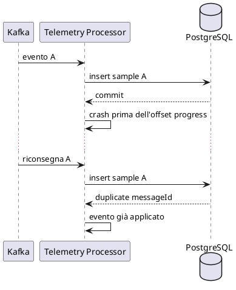

# Affidabilità e failure model

## 1. Assunzioni

In un sistema distribuito, componenti e comunicazioni possono fallire in modo indipendente.

FleetPulse non assume:

- rete sempre disponibile;
- exactly-once delivery;
- cache sempre disponibile;
- una socket read per messaggio;
- stato immediatamente sincronizzato tra componenti.

## 2. Failure matrix

| Guasto | Comportamento atteso |
|---|---|
| TCP frame invalido | Rifiuto senza arrestare il gateway |
| TCP client lento | Timeout e protezione degli altri client |
| Limite connessioni raggiunto | NACK tecnico o rifiuto esplicito |
| Kafka indisponibile al gateway | NACK tecnico, nessun `ACCEPTED` |
| Processor indisponibile | Eventi trattenuti da Kafka |
| Evento duplicato | Nessun side effect duplicato |
| PostgreSQL temporaneamente indisponibile | Il processor non completa il record e applica bounded retry |
| Veicolo inesistente | Rejection asincrona `UNKNOWN_VEHICLE` |
| Veicolo disabilitato | Rejection asincrona `VEHICLE_DISABLED` |
| Rejection topic temporaneamente indisponibile | Retry tecnico, nessuna perdita silenziosa |
| Redis indisponibile | PostgreSQL resta source of truth; persistenza valida e fallback API |
| Crash prima dell'offset progress | Replay gestito idempotentemente |
| Cache stale | Freshness esposta tramite `lastSeenAt` |
| Errore tecnico non recuperabile | Dead-letter secondo la policy prevista |

## 3. Idempotency

### Telemetry

```text
messageId
```

Vincolo:

```text
UNIQUE telemetry_samples.message_id
```

### Alert

```text
sourceMessageId + alertType
```

Vincolo:

```text
UNIQUE maintenance_alerts(source_message_id, type)
```

## 4. Retry policy

Ogni retry policy deve definire:

- massimo numero di tentativi;
- backoff;
- jitter;
- timeout;
- gestione finale;
- log e metriche.

Nessun retry infinito.

## 5. Cache failure

Un errore Redis non annulla la transaction PostgreSQL.

La cache viene riparata tramite:

1. cache-aside durante una lettura;
2. successivo evento di telemetria;
3. procedura esplicita di rebuild.

## 6. Crash del processor



## 7. Ambiguità dell'ACK

Se Kafka accetta un evento ma l'ACK TCP si perde, il client può ritentare.

Il retry usa lo stesso `messageId`.

`ACCEPTED` certifica soltanto la validazione tecnica e la pubblicazione Kafka.
Non certifica esistenza o stato del veicolo, persistenza, aggiornamento Redis,
generazione degli alert o completamento del processor.

## 8. Rifiuti di dominio ed errori tecnici

`UNKNOWN_VEHICLE` e `VEHICLE_DISABLED` sono esiti permanenti di dominio. Il
processor non applica side effect e pubblica l'esito su
`telemetry.rejected.v1`, con log e metriche distinti. La stessa regola di
dominio non viene ritentata indefinitamente.

Un payload Kafka non deserializzabile, un contratto incompatibile o un errore
tecnico che esaurisce i retry viene invece indirizzato a
`telemetry.dead-letter.v1`. Gli errori tecnici temporanei, come PostgreSQL non
disponibile, sono soggetti a bounded retry.

Se la pubblicazione del rejection event fallisce, il record originale non deve
essere perso. L'offset può avanzare soltanto dopo che l'esito è osservabile; il
dettaglio della coordinazione Kafka è definito dalle ticket di implementazione.

## 9. Backpressure

Controlli previsti:

- connection semaphore;
- maximum frame size;
- read timeout;
- Kafka producer timeout;
- bounded retry;
- consumer concurrency configurabile;
- reconnect limitato nel simulator.

## 10. Graceful degradation

Esempio:

```text
Redis non disponibile
-> query PostgreSQL
-> risposta valida ma più lenta
```

La degradazione deve essere visibile tramite log e metriche.
