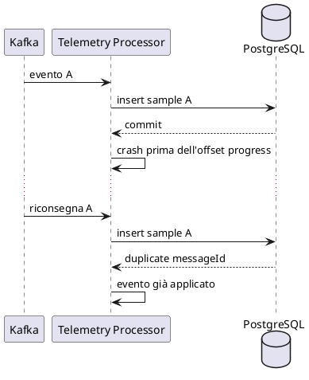

# Affidabilità e failure model

## 1. Assunzioni

In un sistema distribuito, componenti e comunicazioni possono fallire in modo indipendente.

FleetPulse non assume:

- rete sempre disponibile;
- exactly-once delivery;
- cache sempre disponibile;
- una socket read per messaggio;
- stato immediatamente sincronizzato tra componenti.

## 2. Failure matrix

| Guasto | Comportamento atteso |
|---|---|
| TCP frame invalido | Rifiuto senza arrestare il gateway |
| TCP client lento | Timeout e protezione degli altri client |
| Limite connessioni raggiunto | Rifiuto esplicito |
| Kafka indisponibile | Nessun ACK positivo falso |
| Processor indisponibile | Eventi trattenuti da Kafka |
| Evento duplicato | Nessun side effect duplicato |
| PostgreSQL indisponibile | Bounded retry e failure visibile |
| Redis indisponibile | Persistenza valida e fallback API |
| Crash prima dell'offset progress | Replay gestito idempotentemente |
| Cache stale | Freshness esposta tramite `lastSeenAt` |
| Event version non supportata | Dead-letter topic |

## 3. Idempotency

### Telemetry

```text
messageId
```

Vincolo:

```text
UNIQUE telemetry_samples.message_id
```

### Alert

```text
sourceMessageId + alertType
```

Vincolo:

```text
UNIQUE maintenance_alerts(source_message_id, type)
```

## 4. Retry policy

Ogni retry policy deve definire:

- massimo numero di tentativi;
- backoff;
- jitter;
- timeout;
- gestione finale;
- log e metriche.

Nessun retry infinito.

## 5. Cache failure

Un errore Redis non annulla la transaction PostgreSQL.

La cache viene riparata tramite:

1. cache-aside durante una lettura;
2. successivo evento di telemetria;
3. procedura esplicita di rebuild.

## 6. Crash del processor



## 7. Ambiguità dell'ACK

Se Kafka accetta un evento ma l'ACK TCP si perde, il client può ritentare.

Il retry usa lo stesso `messageId`.

## 8. Backpressure

Controlli previsti:

- connection semaphore;
- maximum frame size;
- read timeout;
- Kafka producer timeout;
- bounded retry;
- consumer concurrency configurabile;
- reconnect limitato nel simulator.

## 9. Graceful degradation

Esempio:

```text
Redis non disponibile
-> query PostgreSQL
-> risposta valida ma più lenta
```

La degradazione deve essere visibile tramite log e metriche.
