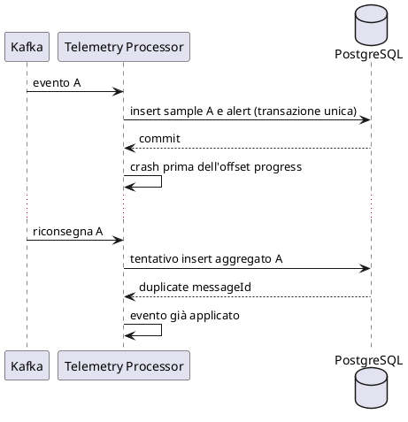

# Affidabilità e failure model

## 1. Assunzioni

In un sistema distribuito, componenti e comunicazioni possono fallire in modo indipendente.

FleetPulse non assume:

- rete sempre disponibile;
- exactly-once delivery;
- cache sempre disponibile;
- una socket read per messaggio;
- stato immediatamente sincronizzato tra componenti.

## 2. Failure matrix

| Guasto | Comportamento atteso |
|---|---|
| TCP frame invalido | Rifiuto senza arrestare il gateway |
| TCP client lento | Timeout e protezione degli altri client |
| Limite connessioni raggiunto | NACK tecnico o rifiuto esplicito |
| Kafka indisponibile al gateway | NACK tecnico, nessun `ACCEPTED` |
| Processor indisponibile | Eventi trattenuti da Kafka |
| Evento duplicato | Nessun side effect duplicato |
| PostgreSQL temporaneamente indisponibile | Il processor non completa il record e applica bounded retry |
| Veicolo inesistente | Rejection asincrona `UNKNOWN_VEHICLE` |
| Veicolo disabilitato | Rejection asincrona `VEHICLE_DISABLED` |
| Rejection topic temporaneamente indisponibile | Retry tecnico, nessuna perdita silenziosa |
| Redis indisponibile | PostgreSQL resta source of truth; persistenza valida e fallback API |
| Crash prima dell'offset progress | Replay gestito idempotentemente |
| Cache stale | Freshness esposta tramite `lastSeenAt` |
| Errore tecnico non recuperabile | Dead-letter secondo la policy prevista |

## 3. Idempotency

### Telemetry

```text
messageId
```

Vincolo:

```text
UNIQUE telemetry_samples.message_id
```

### Alert

```text
sourceMessageId + alertType
```

Vincolo:

```text
UNIQUE maintenance_alerts(source_message_id, type)
```

## 4. Retry policy

Ogni retry policy deve definire:

- massimo numero di tentativi;
- backoff;
- jitter;
- timeout;
- gestione finale;
- log e metriche.

Nessun retry infinito.

### Reconnect del Vehicle Simulator

Ogni workload usa una connessione TCP persistente. Un errore di connessione
attiva una policy con:

- massimo `SIMULATOR_RECONNECT_MAX_ATTEMPTS` tentativi per ciclo;
- backoff esponenziale da `SIMULATOR_RECONNECT_INITIAL_BACKOFF` fino a
  `SIMULATOR_RECONNECT_MAX_BACKOFF`;
- jitter configurabile tramite `SIMULATOR_RECONNECT_JITTER_RATIO`;
- timeout del singolo connect tramite `SIMULATOR_GATEWAY_CONNECT_TIMEOUT`;
- reset della progressione dopo una connessione riuscita;
- terminazione osservabile del workload dopo l'esaurimento dei tentativi.

Un errore di scrittura chiude la socket. Il frame ambiguo non viene reinviato
automaticamente: il retry dello stesso `messageId` richiede la gestione completa
dell'ACK applicativo e non appartiene a FP-016.

## 5. Cache failure

Un errore Redis non annulla la transaction PostgreSQL.

La Fleet API restituisce lo stato dal database anche quando la lettura Redis
e il successivo tentativo di repair falliscono. Dopo il restart di Redis sullo
stesso endpoint, i client devono riconnettersi senza restart dell'API: la
prima lettura utile ripara la cache, le successive possono tornare cache hit.
Il processor riprende la projection con un nuovo evento; non recupera
automaticamente ogni update Redis fallito tramite replay del duplicato.

La latenza degradata dipende dal tipo di guasto: i timeout di lettura/repair
aggiungono attesa, mentre un rifiuto immediato può essere rapido. Il successo
del fallback non richiede che ogni risposta sia più lenta del cache hit.
Il restart con endpoint stabile non dimostra recovery dopo ricreazione del
container con indirizzo IP diverso o invalidazione della cache DNS.

La cache viene riparata tramite:

1. cache-aside durante una lettura;
2. successivo evento di telemetria;
3. procedura esplicita di rebuild.

## 6. Crash del processor


```plantuml
@startuml
participant Kafka
participant "Telemetry Processor" as Processor
database PostgreSQL

Kafka -> Processor : evento A
Processor -> PostgreSQL : insert sample A e alert (transazione unica)
PostgreSQL --> Processor : commit
Processor -> Processor : crash prima dell'offset progress
...
Kafka -> Processor : riconsegna A
Processor -> PostgreSQL : tentativo insert aggregato A
PostgreSQL --> Processor : duplicate messageId
Processor -> Processor : evento già applicato
@enduml
```

Il riavvio mantiene lo stesso consumer group. Il record viene riconsegnato
senza ripubblicazione o reset manuale degli offset; sample e alert conservano
identità e timestamp. Un offset già committed impedisce la riconsegna nel
normale restart dello stesso gruppo, in assenza di reset degli offset.

Un'eccezione gestita nello stesso processo verifica il retry, non il crash
della JVM. I criteri della prova con processo separato sono definiti in
[E2E-003 — Restart del processor](12_STRATEGIA_DI_TEST.md#e2e-003--restart-del-processor).

## 7. Ambiguità dell'ACK

Se Kafka accetta un evento ma l'ACK TCP si perde, il client può ritentare.

Il retry usa lo stesso `messageId`.

`ACCEPTED` certifica soltanto la validazione tecnica e la pubblicazione Kafka.
Non certifica esistenza o stato del veicolo, persistenza, aggiornamento Redis,
generazione degli alert o completamento del processor.

## 8. Rifiuti di dominio ed errori tecnici

`UNKNOWN_VEHICLE` e `VEHICLE_DISABLED` sono esiti permanenti di dominio. Il
processor non applica side effect e pubblica l'esito su
`telemetry.rejected.v1`, con log e metriche distinti. La stessa regola di
dominio non viene ritentata indefinitamente.

Un payload Kafka non deserializzabile, un contratto incompatibile o un errore
tecnico che esaurisce i retry viene invece indirizzato a
`telemetry.dead-letter.v1`. Gli errori tecnici temporanei, come PostgreSQL non
disponibile, sono soggetti a bounded retry.

Se la pubblicazione del rejection event fallisce, il record originale non deve
essere perso. L'offset può avanzare soltanto dopo che l'esito è osservabile; il
dettaglio della coordinazione Kafka è definito dalle ticket di implementazione.

## 9. Backpressure

Controlli previsti:

- connection semaphore;
- maximum frame size;
- read timeout;
- Kafka producer timeout;
- bounded retry;
- consumer concurrency configurabile;
- reconnect limitato nel simulator.

## 10. Graceful degradation

Esempio:

```text
Redis non disponibile
-> query PostgreSQL
-> risposta valida, potenzialmente più lenta
```

La degradazione deve essere visibile tramite log e metriche.

## ADR di riferimento

- [ADR-003 — Kafka tra gateway e processor](adr/ADR-003-KAFKA-TRA-GATEWAY-E-PROCESSOR.md)
- [ADR-004 — PostgreSQL come source of truth](adr/ADR-004-POSTGRESQL-SOURCE-OF-TRUTH.md)
- [ADR-005 — Redis come cache ricostruibile](adr/ADR-005-REDIS-CACHE-RICOSTRUIBILE.md)
- [ADR-006 — At-least-once con application idempotency](adr/ADR-006-AT-LEAST-ONCE-E-IDEMPOTENCY.md)
- [ADR-007 — Validazione del veicolo nel telemetry processor](adr/ADR-007-VALIDAZIONE-VEICOLO.md)
- [ADR-008 — Significato di lastSeenAt e freshness dello stato](adr/ADR-008-LAST-SEEN-AT-E-FRESHNESS.md)


## Ripristino della cache State API — FP-039

Un guasto Redis attiva il fallback PostgreSQL; il repair fallito non modifica
la risposta riuscita. Alla rimozione del guasto, la stessa istanza Fleet API
può ripopolare una chiave assente sulla richiesta successiva; un hit successivo
non consulta PostgreSQL. Il recovery non ricostruisce automaticamente tutte le
chiavi e non richiede un restart dell'API.

La prova isolata usa un proxy di rete per interrompere connessioni o bloccare
risposte lasciando stabile l'endpoint. Le metriche distinguono miss, failure
lettura, fallback e failure repair; i warning restano limitati secondo ADR-010.
La verifica riguarda la State API e non decide readiness/health durante il
guasto Redis (FP-048). Nessun circuit breaker o repair asincrono è introdotto.

Evidenze: [Strategia di test — resilienza della cache](12_STRATEGIA_DI_TEST.md#cache-resilience--verifiche-fp-039-fp-045-e-fp-046).
