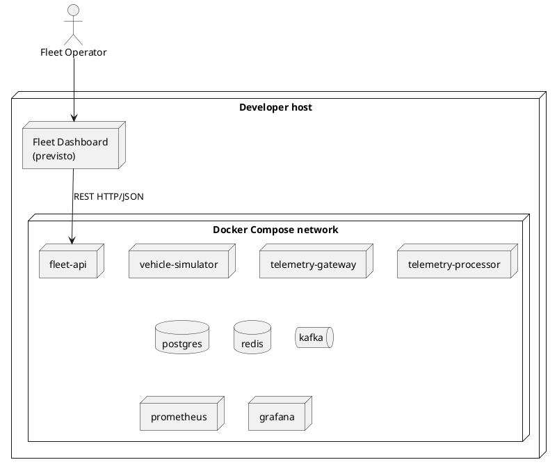

# Deployment design

## 1. Topologia di riferimento



Il container `fleet-dashboard` è previsto ma verrà aggiunto quando il frontend
sarà implementato. Non fa ancora parte dell'orchestrazione eseguibile.

## 2. Dipendenze

| Servizio | Dipendenze necessarie | Dipendenze degradabili |
|---|---|---|
| Telemetry Gateway | Kafka | Accesso al vehicle registry, secondo design |
| Telemetry Processor | Kafka, PostgreSQL | Redis |
| Fleet API | PostgreSQL | Redis |
| Fleet Dashboard | Fleet API | Nessuna |
| Prometheus | Metrics endpoint | Nessuna |
| Grafana | Prometheus | Nessuna |

## 3. Configurazione

La configurazione usa:

- environment variable;
- Spring configuration;
- `.env.example`;
- file montati per observability.

Nessun secret reale nel repository.

```dotenv
POSTGRES_DB=fleetpulse
POSTGRES_USER=fleetpulse
POSTGRES_PASSWORD=change-me

KAFKA_BOOTSTRAP_SERVERS=kafka:9092
REDIS_HOST=redis
REDIS_PORT=6379

GATEWAY_TCP_PORT=7000
GATEWAY_MAX_CONNECTIONS=100
GATEWAY_READ_TIMEOUT=10s
GATEWAY_MAX_FRAME_SIZE=65536

LATEST_STATE_TTL=5m
```

## 4. Container design

Le application image dovrebbero:

- usare multi-stage build;
- eseguire come non-root;
- esporre soltanto le porte richieste;
- supportare health probing;
- usare artifact immutabili;
- scrivere log su standard output;
- non conservare stato durevole nel filesystem del container.

## 5. Volume

Volume persistenti:

- PostgreSQL;
- Kafka, se necessario;
- Grafana, se necessario.

Redis persistence non obbligatoria.

## 6. Startup

L'ordine di startup di Compose non dimostra readiness.

Le applicazioni devono:

- usare retry limitati;
- esporre readiness;
- tollerare dipendenze non ancora pronte.

## 7. Porte

Pubblicare soltanto:

- Fleet API;
- TCP Gateway;
- Grafana;
- Prometheus quando necessario.

Quando implementato, anche il Fleet Dashboard espone una porta HTTP. Il frontend
non espone connessioni dirette verso database, broker, cache o servizi interni.

Database e broker restano interni alla Compose network salvo debug.

## 8. Produzione

Il deployment locale non è production-grade.

In produzione servirebbero:

- Kafka replication;
- PostgreSQL HA e backup;
- TLS e device authentication;
- secret management;
- rollout e rollback;
- network policy;
- capacity planning;
- SLO e alerting;
- log e trace centralizzati.
