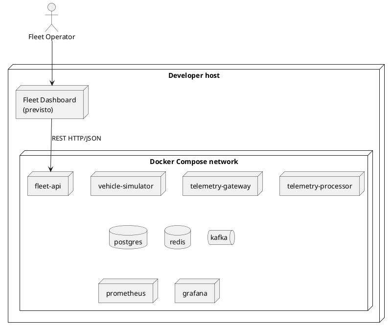

# Deployment design

## 1. Topologia di riferimento



Il container `fleet-dashboard` è previsto ma verrà aggiunto quando il frontend
sarà implementato. Non fa ancora parte dell'orchestrazione eseguibile.

## 2. Dipendenze

| Servizio | Dipendenze necessarie | Dipendenze degradabili |
|---|---|---|
| Telemetry Gateway | Kafka | Nessuna |
| Telemetry Processor | Kafka, PostgreSQL | Redis |
| Fleet API | PostgreSQL | Redis |
| Vehicle Simulator | Fleet API in fase di provisioning, Telemetry Gateway durante l'invio | Nessuna |
| Fleet Dashboard | Fleet API | Nessuna |
| Prometheus | Metrics endpoint | Nessuna |
| Grafana | Prometheus | Nessuna |

Il gateway non accede a PostgreSQL, non chiama Fleet API e non mantiene un
registry dei veicoli. La validazione di esistenza e stato appartiene al
processor.

## 3. Configurazione

La configurazione usa:

- environment variable;
- Spring configuration;
- `.env.example`;
- file montati per observability.

Nessun secret reale nel repository.

```dotenv
POSTGRES_VERSION=17.10-alpine3.23
POSTGRES_DB=fleetpulse
POSTGRES_USER=fleetpulse
POSTGRES_PASSWORD=change-me
POSTGRES_PORT=5432
FLYWAY_VERSION=13.0.0-alpine

REDIS_VERSION=8.2.8-alpine
REDIS_PASSWORD=change-me
REDIS_PORT=6379

KAFKA_VERSION=4.3.1
KAFKA_PORT=9092

FLEET_API_PORT=8080
GATEWAY_TCP_PORT=7000
GATEWAY_HTTP_PORT=8081
PROCESSOR_HTTP_PORT=8082

SIMULATOR_ENABLED=false
SIMULATOR_VEHICLE_COUNT=5
SIMULATOR_GATEWAY_CONNECT_TIMEOUT=3s
SIMULATOR_SEND_INTERVAL=1s
SIMULATOR_SHUTDOWN_GRACE_PERIOD=5s
SIMULATOR_RECONNECT_INITIAL_BACKOFF=250ms
SIMULATOR_RECONNECT_MAX_BACKOFF=5s
SIMULATOR_RECONNECT_MAX_ATTEMPTS=10
SIMULATOR_RECONNECT_JITTER_RATIO=0.2
```

All'interno della rete Compose Kafka pubblicizza `kafka:19092`; il listener
`localhost:9092` è invece riservato ai processi avviati direttamente sull'host.
PostgreSQL e Redis sono analogamente pubblicati soltanto sull'interfaccia di
loopback per supportare il workflow dall'IDE.

## 4. Container design

Le application image dovrebbero:

- usare multi-stage build;
- eseguire come non-root;
- esporre soltanto le porte richieste;
- supportare health probing;
- usare artifact immutabili;
- scrivere log su standard output;
- non conservare stato durevole nel filesystem del container.

## 5. Avvio locale

Prerequisiti: JDK 21, Docker e Docker Compose.

```bash
cp .env.example .env
./mvnw clean verify
docker compose up --build -d
docker compose ps
```

Gli URL locali predefiniti sono:

- Fleet API: `http://localhost:8080`;
- Gateway Actuator: `http://localhost:8081/actuator`;
- Processor Actuator: `http://localhost:8082/actuator`;
- Prometheus: `http://localhost:9090`;
- Grafana: `http://localhost:3000`.

Il frontend non ha ancora un container. Flyway applica le migration versionate
prima dell'avvio dei servizi che usano PostgreSQL; Hibernate è configurato per
non generare o aggiornare automaticamente lo schema.

Il Vehicle Simulator è disabilitato per default. Quando abilitato, Compose ne
ritarda l'avvio fino alla readiness di Fleet API e all'avvio del gateway. Il
simulator applica comunque timeout e reconnect propri: l'ordine Compose non è
considerato una garanzia di disponibilità continua.

Nel gateway non è ancora disponibile un `FrameHandler` di produzione, quindi
il listener TCP resta intenzionalmente disabilitato nello stack corrente.
Abilitare il simulator consente di verificare provisioning e reconnect, ma il
flusso telemetrico end-to-end verso Kafka richiede prima tale integrazione del
gateway. Forzare il listener senza un handler impedisce l'avvio del gateway.

All'arresto, `SIGTERM` chiude le socket dei veicoli, interrompe i virtual thread
e attende fino a `SIMULATOR_SHUTDOWN_GRACE_PERIOD` prima di completare il
lifecycle Spring.

## 6. Volume

Volume persistenti:

- PostgreSQL;
- Kafka, se necessario;
- Grafana, se necessario.

Redis persistence non obbligatoria.

## 7. Startup

L'ordine di startup di Compose non dimostra readiness.

Le applicazioni devono:

- usare retry limitati;
- esporre readiness;
- tollerare dipendenze non ancora pronte.

## 8. Porte

L'ambiente locale pubblica su `127.0.0.1`:

- Fleet API;
- TCP Gateway;
- endpoint Actuator del gateway e del processor;
- PostgreSQL, Redis e il listener esterno di Kafka per il workflow dall'IDE;
- Prometheus e Grafana.

Quando implementato, anche il Fleet Dashboard espone una porta HTTP. Il frontend
non espone connessioni dirette verso database, broker, cache o servizi interni.

La pubblicazione su loopback evita l'esposizione dei servizi sulle altre
interfacce di rete della macchina di sviluppo.

## 9. Produzione

Il deployment locale non è production-grade.

In produzione servirebbero:

- Kafka replication;
- PostgreSQL HA e backup;
- TLS e device authentication;
- secret management;
- rollout e rollback;
- network policy;
- capacity planning;
- SLO e alerting;
- log e trace centralizzati.
