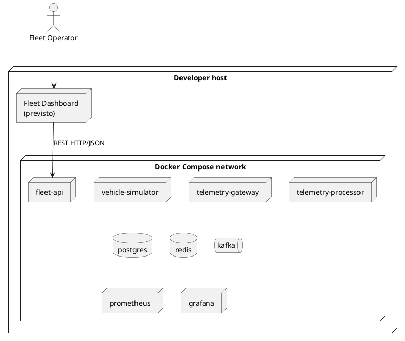

# Deployment design

## 1. Topologia di riferimento


```plantuml
@startuml
actor "Fleet Operator" as Operator
node "Developer host" {
  node "Fleet Dashboard\n(previsto)" as Dashboard
  node "Docker Compose network" {
    node "vehicle-simulator"
    node "telemetry-gateway"
    node "telemetry-processor"
    node "fleet-api" as API
    database "postgres"
    database "redis"
    queue "kafka"
    node "prometheus"
    node "grafana"
  }
}
Operator --> Dashboard
Dashboard --> API : REST HTTP/JSON
@enduml
```

Il container `fleet-dashboard` è previsto ma verrà aggiunto quando il frontend
sarà implementato. Non fa ancora parte dell'orchestrazione eseguibile.

## 2. Dipendenze

| Servizio | Dipendenze necessarie | Dipendenze degradabili |
|---|---|---|
| Telemetry Gateway | Kafka | Nessuna |
| Telemetry Processor | Kafka, PostgreSQL | Redis |
| Fleet API | PostgreSQL | Redis |
| Vehicle Simulator | Fleet API in fase di provisioning, Telemetry Gateway durante l'invio | Nessuna |
| Fleet Dashboard | Fleet API | Nessuna |
| Prometheus | Metrics endpoint | Nessuna |
| Grafana | Prometheus | Nessuna |

Il gateway non accede a PostgreSQL, non chiama Fleet API e non mantiene un
registry dei veicoli. La validazione di esistenza e stato appartiene al
processor.

## 3. Configurazione

La configurazione usa:

- environment variable;
- Spring configuration;
- `.env.example`;
- file montati per observability.

Nessun secret reale nel repository.

```dotenv
POSTGRES_VERSION=17.10-alpine3.23
POSTGRES_DB=fleetpulse
POSTGRES_USER=fleetpulse
POSTGRES_PASSWORD=change-me
POSTGRES_PORT=5432
FLYWAY_VERSION=13.0.0-alpine

REDIS_VERSION=8.2.8-alpine
REDIS_PASSWORD=change-me
REDIS_PORT=6379

KAFKA_VERSION=4.3.1
KAFKA_PORT=9092

TELEMETRY_ALERT_MAXIMUM_ENGINE_TEMPERATURE_C=110.0
TELEMETRY_ALERT_MINIMUM_BATTERY_VOLTAGE=11.8

FLEET_API_PORT=8080
GATEWAY_TCP_PORT=7000
GATEWAY_HTTP_PORT=8081
PROCESSOR_HTTP_PORT=8082

SIMULATOR_ENABLED=false
SIMULATOR_VEHICLE_COUNT=5
SIMULATOR_GATEWAY_CONNECT_TIMEOUT=3s
SIMULATOR_SEND_INTERVAL=1s
SIMULATOR_SHUTDOWN_GRACE_PERIOD=5s
SIMULATOR_RECONNECT_INITIAL_BACKOFF=250ms
SIMULATOR_RECONNECT_MAX_BACKOFF=5s
SIMULATOR_RECONNECT_MAX_ATTEMPTS=10
SIMULATOR_RECONNECT_JITTER_RATIO=0.2
```

All'interno della rete Compose Kafka pubblicizza `kafka:19092`; il listener
`localhost:9092` è invece riservato ai processi avviati direttamente sull'host.
PostgreSQL e Redis sono analogamente pubblicati soltanto sull'interfaccia di
loopback per supportare il workflow dall'IDE.

Il job one-shot `kafka-init` crea idempotentemente i topic applicativi con tre
partizioni e replication factor `1`:

- `telemetry.raw.v1`;
- `telemetry.rejected.v1`;
- `telemetry.dead-letter.v1`.

I nomi sono centralizzati nelle variabili `KAFKA_TOPIC_RAW`,
`KAFKA_TOPIC_REJECTED` e `KAFKA_TOPIC_DEAD_LETTER`. Il replication factor `1`
è adatto esclusivamente alla configurazione locale con un solo broker.

### TTL della latest-state projection (FP-030)

Configurazione implementata in FP-030 secondo [ADR-009 — Contratto e aggiornamento della latest-state projection](adr/ADR-009-LATEST-STATE-PROJECTION.md):

| Property | Tipo | Default | Validazione all'avvio |
|---|---|---|---|
| `fleetpulse.telemetry.latest-state.ttl` | `Duration` | `5m` | Non nulla e almeno `1ms` |
| `fleetpulse.telemetry.latest-state.max-attempts` | `int` | `1` | Almeno `1` |

Il valore è sovrascrivibile tramite configurazione Spring. Un valore invalido
impedisce l'avvio. La conversione deve rispettare la precisione Redis; il TTL
si rinnova solo quando viene accettato un aggiornamento. Non rappresenta la
soglia di freshness della State API.

Le variabili d'ambiente del processor sono `TELEMETRY_LATEST_STATE_TTL` e
`TELEMETRY_LATEST_STATE_MAX_ATTEMPTS`. Il limite dei tentativi include il primo:
con `1`, un conflitto concorrente causa subito un fallimento osservabile della
proiezione, senza rollback PostgreSQL o retry Kafka. I warning sono limitati
a uno ogni 30 secondi per istanza; le metriche contano tutti i fallimenti.

### Soglie alert (FP-033)

| Property | Tipo | Default | Validazione all'avvio |
|---|---|---:|---|
| `fleetpulse.telemetry.alerts.maximum-engine-temperature-c` | `double` | `110.0` | Finito e non inferiore a `-273.15` |
| `fleetpulse.telemetry.alerts.minimum-battery-voltage` | `double` | `11.8` | Finito e strettamente positivo |

Le variabili d'ambiente corrispondenti sono
`TELEMETRY_ALERT_MAXIMUM_ENGINE_TEMPERATURE_C` e
`TELEMETRY_ALERT_MINIMUM_BATTERY_VOLTAGE`. Valori mancanti o non validi
impediscono l'avvio del processor. La soglia manutenzione è specifica del
veicolo ed è rappresentata da `nextServiceAtKm`.

## 4. Container design

Le application image dovrebbero:

- usare multi-stage build;
- eseguire come non-root;
- esporre soltanto le porte richieste;
- supportare health probing;
- usare artifact immutabili;
- scrivere log su standard output;
- non conservare stato durevole nel filesystem del container.

## 5. Avvio locale

Prerequisiti: JDK 21, Docker e Docker Compose.

```bash
test -f .env || cp .env.example .env
./mvnw clean verify
docker compose up --build -d
docker compose ps
```

Gli URL locali predefiniti sono:

- Fleet API: `http://localhost:8080`;
- Gateway Actuator: `http://localhost:8081/actuator`;
- Processor Actuator: `http://localhost:8082/actuator`;
- Prometheus: `http://localhost:9090`;
- Grafana: `http://localhost:3000`.

Il frontend non ha ancora un container. Flyway applica le migration versionate
prima dell'avvio dei servizi che usano PostgreSQL; Hibernate è configurato per
non generare o aggiornare automaticamente lo schema.

Il Vehicle Simulator è disabilitato per default. Quando abilitato, Compose ne
ritarda l'avvio fino alla readiness di Fleet API e del gateway. Il
simulator applica comunque timeout e reconnect propri: l'ordine Compose non è
considerato una garanzia di disponibilità continua.

Il gateway include il `PublishingFrameHandler` di produzione e Compose abilita
il listener TCP con `GATEWAY_TCP_ENABLED=true`. Abilitando il simulator si può
esercitare il flusso TCP → Kafka → processor → PostgreSQL/Redis. La pubblicazione
confermata dal gateway non garantisce che il processor abbia già completato
la persistenza asincrona.

All'arresto, `SIGTERM` chiude le socket dei veicoli, interrompe i virtual thread
e attende fino a `SIMULATOR_SHUTDOWN_GRACE_PERIOD` prima di completare il
lifecycle Spring.

## 6. Volume

Volume persistenti:

- PostgreSQL;
- Kafka, se necessario;
- Grafana, se necessario.

Redis persistence non obbligatoria.

## 7. Startup

L'ordine di startup di Compose non dimostra readiness.

Le applicazioni devono:

- usare retry limitati;
- esporre readiness;
- tollerare dipendenze non ancora pronte.

## 8. Porte

L'ambiente locale pubblica su `127.0.0.1`:

- Fleet API;
- TCP Gateway;
- endpoint Actuator del gateway e del processor;
- PostgreSQL, Redis e il listener esterno di Kafka per il workflow dall'IDE;
- Prometheus e Grafana.

Quando implementato, anche il Fleet Dashboard espone una porta HTTP. Il frontend
non espone connessioni dirette verso database, broker, cache o servizi interni.

La pubblicazione su loopback evita l'esposizione dei servizi sulle altre
interfacce di rete della macchina di sviluppo.

### Prometheus locale — FP-042

La porta Prometheus è pubblicata soltanto su loopback (`PROMETHEUS_PORT`,
default 9090); lo scrape usa i nomi DNS interni dei tre servizi, porta 8080.
Configurazione versionata: `infrastructure/prometheus/prometheus.yml`;
intervallo 15s, timeout 5s. Dopo una modifica riavviare Prometheus:
`docker compose restart prometheus`.

Compose non monta un volume TSDB: la storia non è garantita dopo la
ricreazione del container. La retention usa il default Prometheus di 15 giorni;
questa configurazione serve alla verifica locale, non all'archiviazione.
Il contratto di raccolta è descritto in
[Observability](11_OBSERVABILITY.md#raccolta-delle-metriche).

### Grafana locale — FP-043

Compose monta provisioning e dashboard JSON in sola lettura e conserva il DB
Grafana nel volume `grafana-data`. Il provider carica **FleetPulse Overview**
senza import manuale, nella cartella **FleetPulse**:
`http://localhost:3000/d/fleetpulse-overview/` con le porte predefinite.

```bash
docker compose up -d fleet-api telemetry-gateway telemetry-processor prometheus grafana
```

`GRAFANA_ADMIN_USER` e `GRAFANA_ADMIN_PASSWORD` inizializzano l'admin su storage
vuoto; un volume esistente conserva l'utente già creato. Non cancellare il
volume per aggiornare le dashboard. File JSON aggiornati vengono riletti ogni
30s; dopo modifiche a datasource/provider riavviare Grafana. Dopo modifiche
ai mount/env Compose usare `docker compose up -d grafana`.
UID datasource `fleetpulse-prometheus`, dashboard `fleetpulse-overview`,
folder `fleetpulse`; nessuna dipendenza da ID numerici assegnati dal DB.

Il contratto della dashboard è descritto in
[Observability](11_OBSERVABILITY.md#5-dashboard-grafana--fp-043).

## 9. Produzione

Il deployment locale non è production-grade.

In produzione servirebbero:

- Kafka replication;
- PostgreSQL HA e backup;
- TLS e device authentication;
- secret management;
- rollout e rollback;
- network policy;
- capacity planning;
- SLO e alerting;
- log e trace centralizzati.

## ADR di riferimento

- [ADR-001 — Confini dei servizi](adr/ADR-001-CONFINI-DEI-SERVIZI.md)
- [ADR-003 — Kafka tra gateway e processor](adr/ADR-003-KAFKA-TRA-GATEWAY-E-PROCESSOR.md)
- [ADR-004 — PostgreSQL come source of truth](adr/ADR-004-POSTGRESQL-SOURCE-OF-TRUTH.md)
- [ADR-005 — Redis come cache ricostruibile](adr/ADR-005-REDIS-CACHE-RICOSTRUIBILE.md)

- [ADR-009 — Contratto e aggiornamento della latest-state projection](adr/ADR-009-LATEST-STATE-PROJECTION.md)

## State API (FP-031)

| Property | Override ambiente | Default |
|---|---|---|
| `fleetpulse.api.state.stale-after` | `API_STATE_STALE_AFTER` | `1m` |
| `fleetpulse.api.state.cache.ttl` | `TELEMETRY_LATEST_STATE_TTL` | `5m` |
| `fleetpulse.api.state.cache.max-attempts` | `API_STATE_CACHE_MAX_ATTEMPTS` | `1` |
| `spring.data.redis.connect-timeout` | `SPRING_DATA_REDIS_CONNECT_TIMEOUT` | `500ms` |
| `spring.data.redis.timeout` | `SPRING_DATA_REDIS_TIMEOUT` | `500ms` |

Freshness e TTL devono essere non nulli e almeno `1ms`; i tentativi almeno uno.
Il repair applica il TTL soltanto a una scrittura accettata. Redis non rispondente
può consumare il timeout sia in lettura sia nel repair best effort. I valori sono
configurabili via Spring. Compose inoltra già i due timeout Redis; per gli altri
override aggiungere le variabili al blocco `environment` della Fleet API.
La migration V2 aggiunge l'indice del latest
sample e deve essere applicata dal servizio Flyway prima dell'avvio.

Contratto: [ADR-010](adr/ADR-010-STATE-API-FALLBACK.md).

## Dashboard API — configurazione FP-037

| Property | Variabile ambiente | Default | Limiti |
|---|---|---|---|
| `fleetpulse.api.dashboard.reporting-window` | `API_DASHBOARD_REPORTING_WINDOW` | `1m` | `1ms–1d` |
| `fleetpulse.api.dashboard.relevant-alerts-limit` | `API_DASHBOARD_RELEVANT_ALERTS_LIMIT` | `10` | `1–100` |

Entrambe le variabili sono inoltrate al servizio Fleet API da Compose e presenti
in `.env.example`. Configurazioni mancanti nelle properties o fuori limite
impediscono l'avvio; l'application YAML fornisce i default. Flyway deve applicare
V5 prima dell'avvio. Non modificare le migration già pubblicate.
La dashboard richiede PostgreSQL e non usa Redis. La dipendenza Redis nel
Compose rimane quella condivisa dal servizio Fleet API per gli altri endpoint.

Contratto: [Dashboard REST](09_SPECIFICA_API.md#4-dashboard).

## Formato dei log — FP-040

Le quattro applicazioni emettono JSON ECS sulla console per default, anche con
profilo `local`. Compose inoltra `FLEETPULSE_LOG_FORMAT` a ciascuna applicazione.
Per testo locale impostare esplicitamente `FLEETPULSE_LOG_FORMAT=`; rimuovere
l'override per tornare a ECS. La variabile può essere impostata anche avviando
il JAR direttamente. Non serve configurare un file Logback custom.

## Distribuzione delle latenze — FP-041

Fleet API, gateway e processor espongono gli histogram selezionati dal catalogo
in docs/11. Compose inoltra queste proprietà, impostabili anche avviando il JAR:

| Variabile | Default | Uso |
|---|---|---|
| METRICS_TIMER_MIN | 1ms | Minimo atteso per la distribuzione |
| METRICS_TIMER_MAX | 30s | Massimo atteso per la distribuzione |
| METRICS_TIMER_BUCKETS | 50ms,100ms,250ms,500ms,1s,2s,5s,10s,30s | Bucket espliciti aggiunti all'histogram |

Ricreare il servizio con `docker compose up -d <servizio>` dopo modifiche alle
variabili Compose; `restart` conserva le variabili precedenti. Tenere min < max
e soglie coerenti;
non confondere queste proprietà con timeout, retry o gate prestazionali.
Modifiche ai bucket aumentano/riducono le serie e richiedono verifica delle
query Grafana/Prometheus. Nessun nuovo exporter o tracing è richiesto.

### Probe del deployment locale — FP-048

I tre backend hanno healthcheck Compose su `/actuator/health/readiness`, con
intervallo 5 s, timeout 5 s, start period 20 s e 12 tentativi. Il simulatore
attende API e gateway healthy. Una porta HTTP aperta o uno scrape riuscito non
sostituiscono queste probe; anche l'harness FP-047 attende readiness UP.

API e processor attendono che il container Redis sia avviato (`service_started`),
non healthy: cache/projection opzionali non devono bloccare il ruolo applicativo.
PostgreSQL/migrazioni e Kafka/topic mantengono i gate critici esistenti. Questo
non promette cold start senza DB, necessario alla validazione Hibernate.

Un container unhealthy non viene automaticamente riavviato da Compose: la
restart policy riguarda l'uscita del processo. Le probe non sospendono da sole
traffico TCP, richieste REST o consumer Kafka. La matrice delle dipendenze e i
timeout sono definiti in [Observability](11_OBSERVABILITY.md#health-liveness-e-readiness--fp-048).

## Security baseline locale — FP-054

Lo stack Compose è destinato allo sviluppo su una macchina fidata. Tutte le porte
pubblicate sono associate a `127.0.0.1`; i servizi comunicano nella rete Compose.
Il bind loopback riguarda l'host: dentro i container i listener devono restare
raggiungibili dai peer, incluso lo scrape Prometheus.

Le applicazioni Java e il simulatore eseguono come UID/GID `10001:10001`.
PostgreSQL e Redis usano rispettivamente gli utenti `postgres` e `redis` delle
immagini; Flyway esegue come `10001:10001` con migration montate read-only.
Kafka, kafka-init, Prometheus e Grafana mantengono gli utenti non-root forniti dalle
rispettive immagini. Anche i job di inizializzazione devono completarsi senza root.
I volumi PostgreSQL esistenti devono appartenere all'utente dell'immagine: cambiare
immagine/UID richiede una migrazione dei permessi, non la cancellazione dei dati.

I tre backend espongono esclusivamente health/probe e Prometheus tramite Actuator;
health non pubblica dettagli o componenti. `info`, `env`, `configprops`, `heapdump`,
`loggers` e gli altri endpoint amministrativi non sono esposti. La discovery
`/actuator` resta disponibile. REST, OpenAPI/Swagger e TCP restano accessibili
senza autenticazione: il loopback limita l'accesso di rete, non autorizza gli utenti
locali né i container connessi alla rete Compose.

`.env` non è tracciato da Git ed è escluso dal build context Docker. `.env.example`
contiene placeholder, da sostituire prima dell'uso. Le credenziali sono trasmesse
come variabili d'ambiente: chi controlla Docker può leggerle. Le credenziali Grafana
inizializzano il database al primo avvio; cambiarle in `.env` non ruota automaticamente
quelle di un volume già inizializzato.

Questa baseline non rende il progetto production-ready: mancano autenticazione e
autorizzazione REST/TCP, TLS e autenticazione Kafka, separazione dei privilegi DB
(il ruolo locale è condiviso con Flyway), gestione/rotazione centralizzata dei segreti
e isolamento delle reti per ruolo. Prometheus non richiede autenticazione; Redis
usa password senza TLS. Il pinning tramite digest, la scansione delle vulnerabilità
e l'hardening finale delle immagini appartengono a FP-072. Non pubblicare questo
Compose su interfacce pubbliche o tramite proxy/tunnel senza progettare tali controlli.
